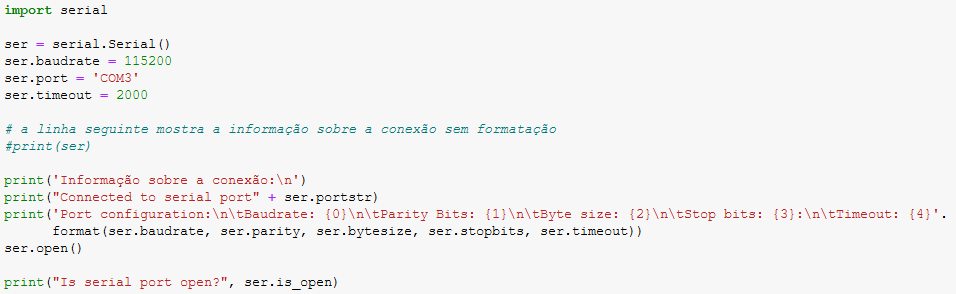
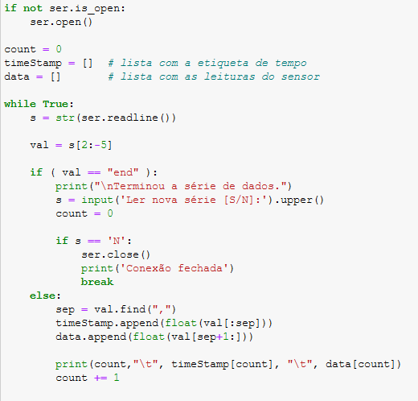
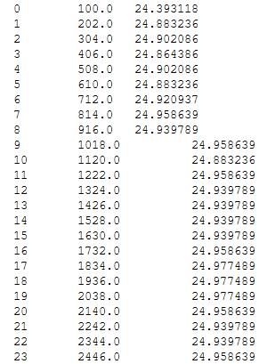
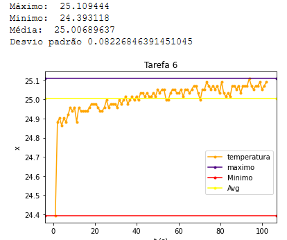
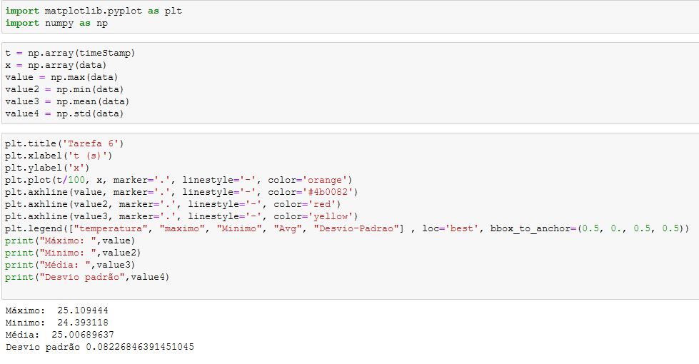

# Relatório da Tarefa 6

## Física Aplicada à Computação

### Licenciatura em Engenharia Informática - 1º Ano / 1º Semestre

#### Ano Lectivo 2021-22

#### Docente: Nuno S. A. Pereira

##### _Departamento de Matemática e Ciências Físicas_
---

### Autor(es):

#### Tiago Pacheco (N.º 20296)

---
<br>

## **Tarefa 6 - Visualização das leituras dos sensores**

<br>

## **Introdução**

Para a sexta e ultima tarefa do conjuntos de tarefas dado, foi pedido que fosse elaborado uma leitura de dados via Serial port, para receber a leitura de um dos sensores do Arduino nano 33 BLE Sense e apresentar o gráfico.

<br>


### **Objectivo**

O Arduino Nano 33 BLE Sense possui vários sensores e estão disponíveis bibliotecas para podermos aceder às medições que efectuam. Após instaladas, essas bibliotecas fornecem exemplos onde se apresenta a utilização dos métodos que permitem aceder à leitura de cada grandeza. Nesta tarefa vamos tomar como ponto de partida esses sensores para implementar o pretendido. 

Utilizando um exemplo disponibilizado de notebook jupyter pelo docente, com o objetivo de criar um gráfico respeitovo de um sensor como referido em cima na introdução da tarefa. Dentro desta tarefa era pretendido o seguinte, além de um gráfico:

1. Calcular os valores mínimo, máximo, a média e o desvio padrão do conjunto de valores demonstrado.

2. Fazer um novo gráfico com a linhas da média, dos valores mínimo e máximo, juntamente com as medidas do sensor.


### **Método experimental**

Para iniciar a tarefa foi usado como base e referidfo anteriormente um notebook jupyter de exmplo sendo este fornecedoido pelo docente, onde tinha uma boa ideia de como começar a implemntar a tarefa e como mostrar gráficos utlizando a linguagem de programção python. Inicialemnte foi introduzido o sensor que queria utlizar no codigo em arduino. O sensor a ser utlizado foi o <i>HTS221.Temperature</i>.


```c++
void writeData()
{
 
  to = millis();
  for (byte k = 0; k < n_samples; k++)
  {
    delay(100);
    int long t = millis() - to;
    float x = HTS.readTemperature();

    sprintf(strBuffer,"%d,%.6f", t, x);
    Serial.println(strBuffer);

  }
}

```

Para que fosse possivel ler dados serial , sendo este dados uplouded do ficheiro .ino criado com o codigo que mpstrasse a tempratuira do sensor, foi necessário como demonstra a primeira imagem que fosse selecionado corretamente a serial.port que seria usada assim como o baudrate correto, pois se não fosse implementado corretamente estes dois pontos não era possivel aceder aos dados via serial. Em seguida foi verificado o código exemplo logo em baixo, de modo a perceber o funcionamento do mesmo. Sendo que no print final o objetivoo era demonstrar a contabilização de interações , o seu timestamp, isto é, quando tempo demora para ser disponibilizado o valor da temperatura, valor este que estaria logo á sua direita.

<br>

<center> <b><h3>Implementações e Verificações Iniciais</h3></b> </center>
<br>

<center>


<p align = "center"><i><b>Fig.1 - Import da Serial do Arduino</b></i></p>

<p align = "center"><i><b>Acesso aos dados proveninetes do Serial</b></i></p>

</center>

<br>

Correndo o código explicado em cima, começa então a ser executado a montorização da temperatura, dos dados fornecidos pelo arduino, que posteriormente serão disponibilizados em forma de um gráfico como o pretendido.

<br>

<center>

<p align = "center"><i><b>Temperaturas a serem obtidas</b></i></p>
</center>


<br>

### **Resultados**

<br>
<center> <b><h3>Resultados Finais Tarefa 6</h3></b> </center>
<br>

<center>


<p align = "center"><i><b>Gráfico do sensor</b></i></p>


</center>

<br><br>

### **Tratamento de dados**

Os dados produzidos com o decorrrer do script, foram tratados através de <i>"numpy"</i> , sendo uma biblioteca bastante conhecida no mundo de <i>Python</i>. Para tal foram criadas varias variáveis que eram igualadas a variavies funciones numpy , onde iraia buscar os valores maximos, minimos, desvio padraos e amedia aritmeticas , sendo que desta forma é calculado de uma forma muito mais rapida e eficiente. Em seguida tods estes dados guradados em variaveis foram colocados num simples gráfico que demosntrada a sua evolução aos longo do numero de intereções. 

<br>
<center>
<p align = "center"><i><b>Tratamento dos dados</b></i></p>
</center>


### **Discussão**

Para esta tarefa não senti muitas dificuldades , sendo que era bastante objetiva no que era pretendido. De resto foi só jogar com as funções disponibilizadas pela biblioteca <i>numpy</i>.

<br>


---
## **Referências**

1. Conteudo disponibilizado na página da Cadeira; <br>
2. https://numpy.org/doc/stable/reference/routines.math.html.