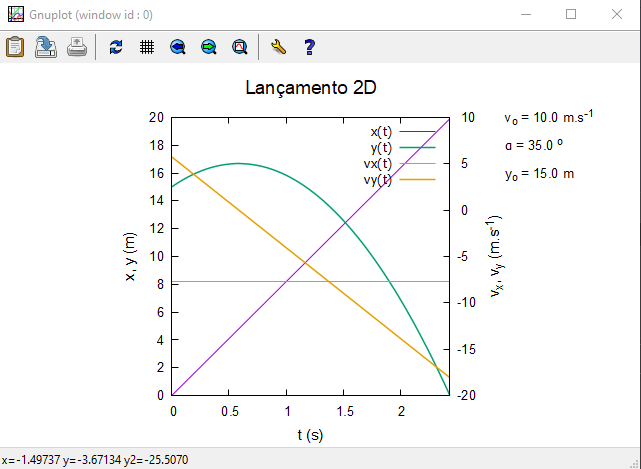
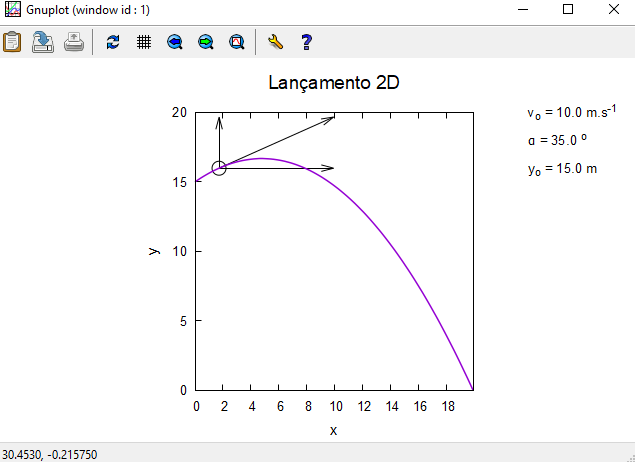
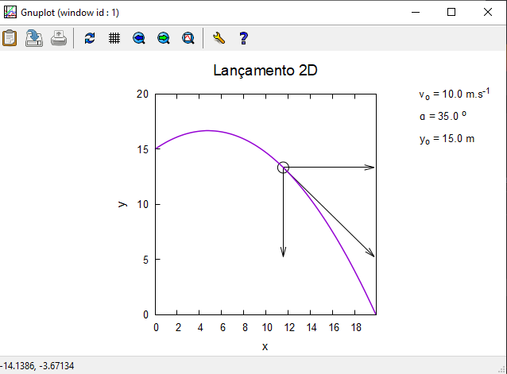
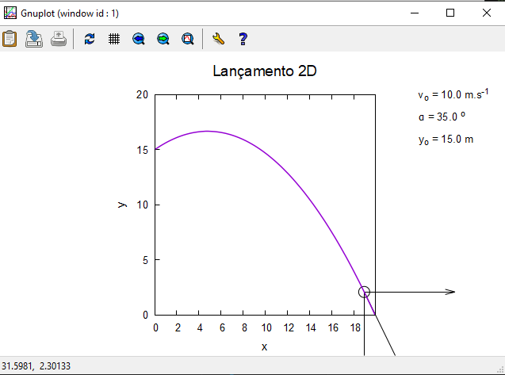

---

# Relatório da Tarefa 1

## Física Aplicada à Computação

### Licenciatura em Engenharia Informática - 1º Ano / 1º Semestre

#### Ano Lectivo 2021-22

#### Docente: Nuno S. A. Pereira

##### _Departamento de Matemática e Ciências Físicas_
---

### Autor(es):

#### Tiago Pacheco (N.º 20296)

---

## **Introdução**

Para a primeira tarefa de um conjunto de 6, foi pedido que fosse elaborado uma animação de um lançamento de um projétil na dimensão de 2D, complementando o que foi dado em aula no início do semestre. Tendo em conta um conjunto de dados introduzidos pretende se verificar um movimento de um objeto e sua trajétoria. De seguida será mostrado todos os passos de forma objetiva para a elaboração da primeira tarefa.

---

## **Tarefa 1 - Animação de lançamento de projéctil 2D**

### **Objectivo**

Como referido na introduçao á tarefa número 1, esta foi elaborada com base em algo que foi feito e trabalhado em aula, sendo que foi sempre tendo como ponto de partida os exemplos de <i>scripts</i> para o lançamento de projécteis 2D e o exemplo de animação elaborados pelo docente Nuno Pereira. Com isto, o objetivo seria criar um <i>script</i> que permitisse ver uma animação de um projéctil ao longo da trajectória calculada. Numa segunda versão, a implementação da visualização dos vectores velocidade $\vec{v}$ ,$\vec{v}_{x}$ e $\vec{v}_{y}$, em cada ponto da órbita.  	


### **Método experimental**

Para iniciar a tarefa foi necessário inicialmente colocar as condições inicias do protótipo nos valores pretendidos , para que  os resultados fossem crediveis, como o pretendido. Foi definido que a velociade incial era de 10 metros/ por segundo, um angulo de 35 graus (trajétoria) , uma posição de 15 metros a contar do eixo do y e por fim uma gravidade de -9.8. Com isto foram então criadas as seguintes equações para que o pretendido fosse possível ser demonstrado:

<b>
<br>

1. Equação para a velocidade  incial em 
$x$ e $y$;
2. Cálculo do tempo de voo;
3. Equações do Movimento;
4. Equações das velociades;
5. Definição do tempo Máximo.

</b>

Todas estas equações encontraram se no código disponibilizado na entrega da tarefa, de modo a  demonstrar a veracidade do mesmo.

<br><center> <h2>Condições Iniciais</h2> </center>

--- 

$$vo = {10 m/s}.$$
$$\alpha = {35°}.$$
$$yo = {15 m/s}.$$
$$g (gravidade) = {-9.8 m/s^{2}}.$$
---
<!--- T$$vox = {vo * cos(\alpha)}.$$
$$voy = {vo * sin(\alpha)}.$$

---
$$a = {0.5* g}.$$
$$b = {voy}.$$
$$c = {yo}.$$
---
$$t_voo = \frac{-b - \sqrt{b^{2}-4ac}}{2a}\:$$
---

$$x(t) = {vox * t)}$$
$$y(t) = {yo * voy*t + 0.5*g*t^{2}}.$$
---
$$vx(t) = {vox)}$$
$$vy(t) = {voy + g*t}$$
--- -->

<br>

Com as equações criadas , foi então inciado o modo paramétrico como demonstrado no código abaixo, assim como definido um <i>autoscale</i> para que todas as variáveis neste modo tivessem todas sem grandes diferenças. Foi definido que o xmax era igual ao tempo de voo anteriormente definido, e por fim que o xrange seria de 0 a xmax e o yrange de 0 a 20 de modo a que o plot do gráfico ficasse visualmente bem conseguido.


```c++
pause (-1)
set term wxt 1 enhanced
set xlabel "x"
set ylabel "y"
unset y2label
unset y2tics
unset key
set parametric
set autoscale
set trange[0:t_voo]


xmax = x(t_voo)
set xrange [0:xmax]
set yrange [0:20]

```

<br>
Para que fosse demonstrado a a linha da trajétoria e um objeto que a percorresse , foi necessário dar plot de x(y) e y(t), anteriormente definidos para mostrar a trajetória , e tambem um <i>"set object"</i> de modo a criar um circulo que ficasse tanjente á trajetória. O restante codigo é referente ao número de intereções que o circulo iria realizar, portanto de modo a que o circulo fizesse as intereções necessárias para percorrer a trajetória sem erros. Para finalizar foi tambem pedido na tarefa , a colocação de vetores , enquanto a trajetória do criculo estava em execucão. Para isso foi necessário adicionar um objeto do tipo <i>arrow</i>, 3 vezes, fazendo um plot correspondente ao necessário - velociade geral, velocidade em x e por fim velociadade em y.

<br>

``` c++ 

t = 0
dt = .03

do for[n=1:82] { # em 360 graus , tendo um dt de .5 vai rodando de 0.5 ate os 360 graus
   t = n*dt

plot  x(t), y(t) axis x1y1 w l lw 1.5, 1/0, 1/0
   set object 1 circle at x(t),y(t) size .5

   set arrow 1 from x(t),y(t) rto vx(t),0 #Vetor velocidade de x com y = 0
   set arrow 2  from x(t),y(t) rto 0,vy(t) #Vetor velocidade de y com x = 0
   set arrow 3 from x(t),y(t) rto vx(t),0 + vy(t) #velocidade total

}

```


### **Resultados**

<br>
<center> <b><h3>Resultados Finais</h3></b> </center>
<br>

<center>


<p align = "center"><i><b>Fig.1 - Lançamento 2D - 1º wpp</b></i></p>

<p align = "center"><i><b>Fig.2 - Lançamento 2D - 2º wpp</b></i></p>

<p align = "center"><i><b>Fig.3 - Lançamento 2D - 3º wpp</b></i></p>

<p align = "center"><i><b>Fig.4 - Lançamento 2D - 4º wpp</b></i></p>


</center>

<br><br>

### **Discussão**

Para a resolução desta tarefa foram encontradas algumas dificulades no ambito da movimentação do objeto do tipo circulo, no qual foi resolvido com entre ajuda de colegas. De resto foi necessário essencialmente perceber o que era pretendido, e perceber as equações implementadas, de modo a que tudo junto fosse possível criar o pretendido. 

<br>

## **Referências**

<br>

1. Conteudo disponibilizado na página da Cadeira; <br>
2. https://stackoverflow.com/questions/15553988/how-to-draw-just-arrow-in-gnuplot.