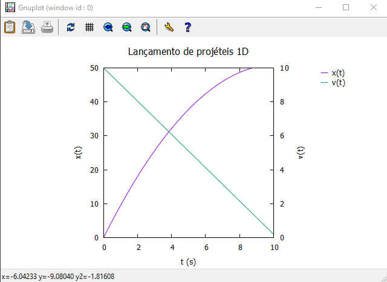
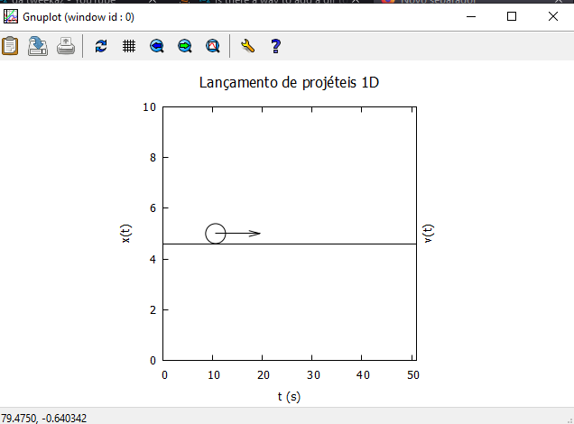
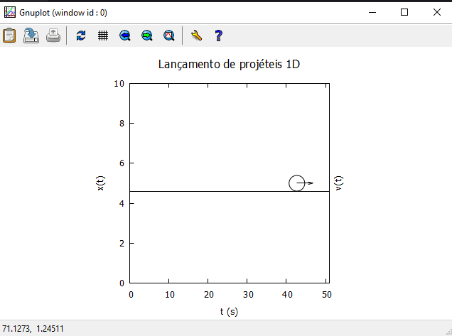
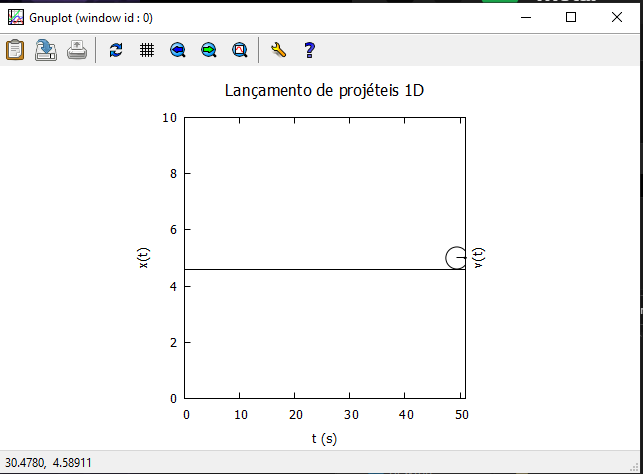

---

# Relatório da Tarefa 2

## Física Aplicada à Computação

### Licenciatura em Engenharia Informática - 1º Ano / 1º Semestre

#### Ano Lectivo 2021-22

#### Docente: Nuno S. A. Pereira

##### _Departamento de Matemática e Ciências Físicas_
---

### Autor(es):

#### Tiago Pacheco (N.º 20296)

---


## **Tarefa 2 - Animação de movimento 1D com atrito**

<br>

## **Introdução**

Para a segunda tarefa de um conjunto de 6, foi pedido que fosse elaborado uma animação de um movimento de uma dimensão com  atrito, complementando o que foi dado em aula no inicio de semestre. Tendo em conta um conjunto de dados introduzidos pretende se ver um movimento de um objeto e sua trajetória. De seguida será mostrado todos os passos de forma objetiva para a elaboração da segunda tarefa.

<br>

### **Objectivo**

Como referido na introdução á tarefa número 2, esta foi elaborada com base em algo que foi feito e trabalhado em aula, sendo que foi sempre tendo como ponto de partida os exemplos de <i>scripts</i> para o lançamento de projécteis 2D e o exemplo de animação elaborados pelo docente Nuno Pereira. Com isto, o objetivo seria criar um <i>script</i> que permitisse ver uma animação do movimento em 1D de um objeto numa superfície, com um determinado coeficiente de atrito. Por fim era pretendido tambem a implementação de um vetor de velocidade ($v$) que mostrasse a velocidade a ser reduzida ao longo do deslocamento devido ao atrito anteriormente referido.   

<br>


### **Método experimental**


Para iniciar a tarefa foi necessário inicialmente colocar as condições inicias nos valores pretendidos , para que  os resultados fossem crediveis, com o pretendido. Foi definido que a velociade incial seria de 1 metros/ por segundo, a posição incial a começar em 0 , um coeficiente de 0.1 e gravidade de 9.8, sendo que a multiplicação dessas duas variáveis dará o valor do atrito. Com isto foram então criadas as seguintes equações para que o pretendido fosse possível ser demonstrado:

<b>
<br>

1. Equações do Movimento;
2. Tempo máximo da movimentação;
3. Máximo valor correspondendo ao eixo do $x$.

</b>

Todas estas equações encontraram se no código disponibilizado na entrega da tarefa ,de modo a  demontsrar a veracidade do mesmo.


<br><center> <h2>Condições Iniciais</h2> </center>

--- 

$$vo = {10 m/s}.$$
$$xo = {0 m}.$$
$$coe = {0.1}.$$
$$g (gravidade) = {9.8 m/s^{2}}.$$
$$a = {g * coe}.$$
---


<br>
Com as equações criadas , foi então iniciado o modo paramétrico como demonstrado no código abaixo, assim como definido um autoscale para que todas as variáveis neste modo tivessem todas sem grandes diferenças. Foi definido que o xrange começava em 0 até ao xmax definido, igualemnte como o x2range. O yrange foi definido de 0 a 10 sendo um conjuntod e valores para testar o funciuonaemnto do <i>script</i>.

<br>

```c++
pause (-1)
set parametric
set autoscale
unset y2tics
unset key

set xrange [0:xmax]
set x2range [0:xmax]
set yrange [0:10]

```
<br>
Para que fosse demonstrado o movimento foi realizado o plot x(t), y(t) antes de criar objetos. Feito o <i>plot</i> foi criado uma objeto do tipo circulo muito ao exemplo do que foi elaborado na primeira tarefa, onde esse mesmo objeto precorresse o movimento tanjecialemente, o que era o pretendido. O restante codigo é referente ao número de intereções que o circulo iria realizar, portanto de modo a que o circulo fizesse as intereções necessárias para percorrer o moviemnto desejado sem erros. Para finalizar foi tambem pedido na tarefa , a colocação de um vetor que mostrasse a velocidade do objeto a reduzir a sua velocidade devido ao atrito. Para tal foi feito um <i>set "arrow" </i>, que fosse coletando os valores da velociade correspondemente ao tempo , enquanto realizava o movimento. Por fim foi colocado uma linha em baixo do movimento como demonstrado no exemplo do docente, onde para tal foi novamente usado o <i>set arrow</i>, mas desta vez com a particularidade de se usar o paramêtro <i>"no head"</i>, que faz com que retire o fim de uma seta normal.

<br>

``` c++ 

dt = 0.04
t = 0

do for[n=0 : 210] { # em 360 graus , tendo um dt de .5 vai rodando de 0.5 ate os 360 graus
   t = n*dt
   set object 1 circle at x(t),5 size 2
   set arrow 1 from x(t),5 rto v(t)
   set arrow at xo,4.6 rto xmax,0 nohead

  plot 1/0, 1/0
}

```


### **Resultados**

<br>
<center> <b><h3>Resultados Finais Tarefa 2</h3></b> </center>
<br>

<center>


<p align = "center"><i><b>Fig.1 - Movimento 1D - 1º </b></i></p>

<p align = "center"><i><b>Fig.2 - Movimento 1D - 2º</b></i></p>

<p align = "center"><i><b>Fig.3 - Movimento 1D - 3º</b></i></p>

<p align = "center"><i><b>Fig.4 - Movimento 1D - 4º</b></i></p>


</center>

<br><br>

### **Discussão**

Para a resolução desta tarefa foram encontradas algumas dificulades no ambito da movimentação do do objeto, num plano linear, pois inicialmente o movimento estava a ser ligeiramente para baixo o que não era o pretendido, no qual foi resolvido com alguma pesquisa e uma breve ajuda do docente , onde me indetificou o problema que posteriormente o consegui resolver.  

<br>

## **Referências**

<br>

1. Conteudo disponibilizado na página da Cadeira; <br>
2. https://stackoverflow.com/questions/15553988/how-to-draw-just-arrow-in-gnuplot.