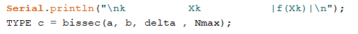

# Relatório da Tarefa 4

## Física Aplicada à Computação

### Licenciatura em Engenharia Informática - 1º Ano / 1º Semestre

#### Ano Lectivo 2021-22

#### Docente: Nuno S. A. Pereira

##### _Departamento de Matemática e Ciências Físicas_
---

### Autor(es):

#### Tiago Pacheco (N.º 20296)

---


## **Tarefa 4 - Métodos numéricos para cálculo de raízes de equações não lineares**

<br>

## **Introdução**

Para a quarta tarefa de um conjunto de 6, foi pedido que fosse implementado dois métodos numéricos para a resolução de equações do tipo f(x) = 0. Os dois métodos abordados seriam o método da bisseção e o método de Newton- Raphson, onde nesses mesmos iriam ser realizados alguns cálculos correspondendo ao pedido pela tarefa.

<br>


### **Objectivo**

Nesta tarefa é pretendido que sejam implementados dois métodos numéricos para a resolução de equações do tipo:

$$ f(x)=0 $$ 

Os dois métodos que serão considerados são:

    Método da Bissecção: o esquema iterativo necessita de um intervalo inicial [a,b] que contenha pelo menos uma raíz da equação e, em cada iteração $k$ calculamos o ponto médio do intervalo:
$$ck=(ak+bk) / 2.$$

    Método de Newton-Raphson: o esquema iterativo necessita de uma aproximação inicial da raíz, xo, e é definido pela seguinte equação:

$$ xn+1=xn−f(xn)/f′(xn) $$

<br>

Pretende que seja elaborado sketches para o Arduino que implementem os dois métodos numéricos, com os seguintes requisitos:

1. Utilizar directivas ao pré-processador para seleccionar precisão simples (float) ou dupla (double) no mesmo código.

2. A cada iteração, escrever para o Serial Monitor: número da iteração, raíz aproximada, módulo da função na raíz aproximada: kxk|f(xk)|.

3. Considerar |f(xk)|<δ, em que δ é a tolerância, como critério de paragem.

4. Dispor de um critério de número máximo de iterações; no final o código deve indicar se a tolerância foi alcançada dentro do limite de iterações ou não.

5. No caso do Método da Bissecção implementar uma versão com o número de iterações pré-definido em função de δ.

6. No caso do Método de Newton implementar uma versão que substitua o cálculo da derivada f′(xk)
por uma aproximação numérica definida por:

$$f′(xk)≈f(xk+h)−f(xk)h$$


em que h é uma valor "pequeno" da ordem de, por exemplo, 10−6.

E por fim deve ser implementado a medição dos tempos de execução recorrendo à função micros(). Neste caso, para não influenciar a estimativa do tempo de cálculo, os códigos não devem escrever os resultados intermédios via Serial Monitor. Esta opção deve estar definida com directivas ao pré-processador.

### **Método experimental**
Para iniciar a realização desta tarefa foi usado de exemplo 2 sketches que forma fornecdios pelo professor, no decorrer das aulas, onde foi uma boa base para a realização da tarefa. Primeiramente foram definidas as variaveis a serem utilizadas e definidos os principidos de cada sketch. Com isso realizado foi passado apra o proximo passa que seria a utilização de diretivas ao pré-processador onde era pretendido que fosse possivel selecionar precisão simples (float) ou precisão dupla (double).

<br>

---

<center> <h2>Variaveis Globais Bisseção</h2> </center>

--- 

$$a = {0.}$$
$$b = {1.} $$
$$\Delta = {1.e-4}.$$
$$Nmax$$

<br>

---

<center> <h2>Variaveis Globais Newton</h2> </center>

--- 

<br>

$$xo = {0}$$
$$\delta = 1.e-12 $$
$$nMax = {171}.$$
$$Nmax$$

---
<!--- T$$vox = {vo * cos(\alpha)}.$$
$$voy = {vo * sin(\alpha)}.$$

---
$$a = {0.5* g}.$$
$$b = {voy}.$$
$$c = {yo}.$$
---
$$t_voo = \frac{-b - \sqrt{b^{2}-4ac}}{2a}\:$$
---

$$x(t) = {vox * t)}$$
$$y(t) = {yo * voy*t + 0.5*g*t^{2}}.$$
---
$$vx(t) = {vox)}$$
$$vy(t) = {voy + g*t}$$
--- -->

<br>
Para a inclusão dessas mesmas diretivas ao pré processador foi definido no inicio de cada sketches o seguinte codigos: #define Type float/double, onde assim o utilizador teria a possibilidade de verificar os resultados em precisão simples ou precisão dupla, respetivamente, apenas mudando o tipo do #define.

<br>

```c++
#define TYPE float

```
Continuando a realização desta tarefa , foi agora implementado que no modo monitor , fosse apresentado pela seguinte ordem , os valores disponilizados pelos cálculos. Seria então apresentado pela seguinte ordem no monitor: número da iteração, raíz aproximado e por fim o módulo da função na raíz aprioximada : $k$    $xk$   $|f(xk)|$.

<br>
<center>


<p align = "center"><i><b>Fig.1 - Apresentação de dados - Modo Newton</b></i></p>


</center>

<br>

<center>


<p align = "center"><i><b>Fig.2 - Apresentação de dados - Modo Bisseção</b></i></p>


</center>

De seguida foi realizado um critério de paragem , onde seria usado uma tolêrancia, onde foi necessário fazer alguns testes no código base de modo a conseguir e ser possivel obter resultados certos , mudando o numero de intereções que seriam realizadas. Esta implementação foi realizada para ambas as implementações: Bisseção e Newton. Uma parte do código referente a esta impelmentação encontra se em baixo, sendo que o restante código será anexado ao relatório no ato de entrega.

<br>


```c++
TYPE bissec( TYPE a, TYPE b, TYPE delta, int Nmax ) {
  if ( f(a) * f(b) > 0 ) {
    Serial.print("O intervalo não é válido!");
    return 999;
  } else {
    int cnt = 1;
    TYPE c;
    TYPE fc = 1.;
    while ( (cnt <= Nmax ) && abs(f(c)) > delta)  {
      c = (a+b)/(TYPE)2.;
      fc = f(c);
      if ( f(a) * fc < 0. ) {
        b = c;     
      } else {
        a = c;
      }
      Serial.print(cnt);
      Serial.print("\t");
      Serial.print(c, 12);
      Serial.print("\t"),
      Serial.println(abs(f(c)), 12);
      cnt++;
    }
    return c;
  }

```

```c++
TYPE newton(TYPE xo, TYPE delta, int Nmax) {
int counter = 1;
  TYPE fx = 1.;
  TYPE x=xo;
  
  while ( counter <= Nmax && abs(fx) > delta ) {

    fx = f(x);
    x = x - fx/df(x);
        
    Serial.print(counter);
    Serial.print("\t");
    Serial.print(x, 12);
    Serial.print("\t");
    Serial.println(abs(fx), 12);
    
    counter++;
  }
  return x;

```

<br>

### **Resultados**


<center> <b><h3>Resultados Finais Tarefa 3</h3></b> </center>
<br>

<center>


<p align = "center"><i><b>Fig.3 - Resultados Bisseção</b></i></p>


</center>

<center>


<p align = "center"><i><b>Fig.4 - Resultados Newton</b></i></p>


</center>

<br><br>


### **Discussão**

Esta tarefa foi bastante dificil para mim, onde não consegui efetivamente realizar tudo o que era pretendido. Dentro do que foi realizado penso que esteja bem feito. As maiores dificuldades nesta tarefa foi o tentar perceber o que era para fazer, sendo que todas as tentativas de resolução de cada parte da tarefa nem sempre correram como o pretendido. No geral penso que poderia ter corrido bem melhor, mas dei o meu melhor, como em todas as tarefas.

<br>