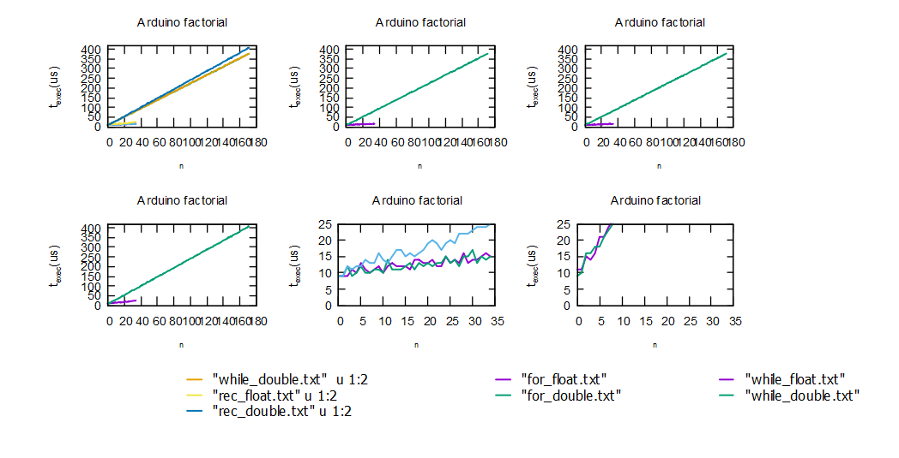
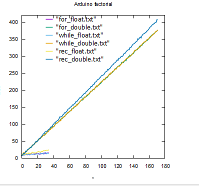
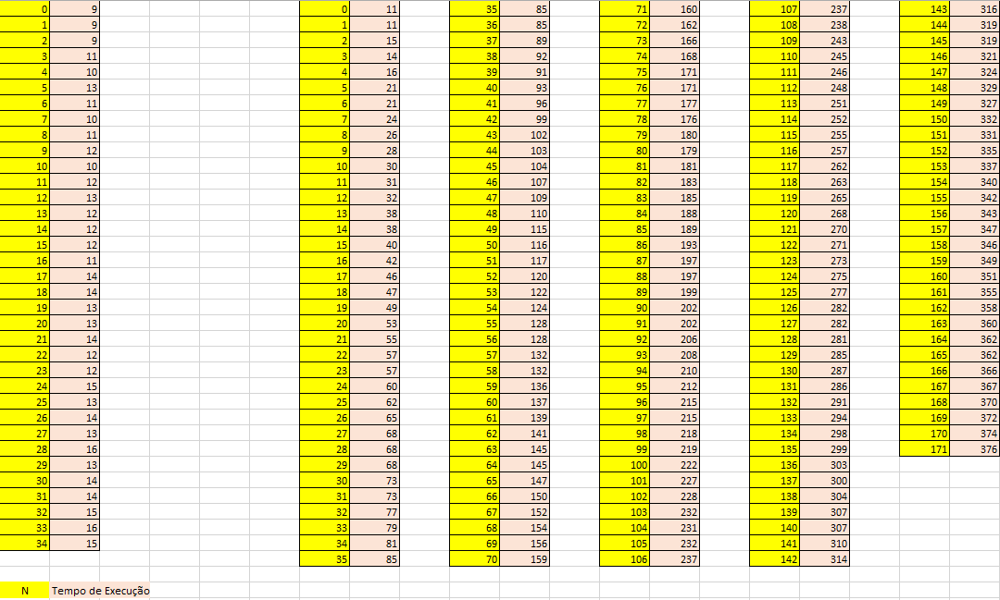

# Relatório da Tarefa 3

## Física Aplicada à Computação

### Licenciatura em Engenharia Informática - 1º Ano / 1º Semestre

#### Ano Lectivo 2021-22

#### Docente: Nuno S. A. Pereira

##### _Departamento de Matemática e Ciências Físicas_
---

### Autor(es):

#### Tiago Pacheco (N.º 20296)

---

## **Tarefa 3 - Implementação da função factorial de um número inteiro**

<br>

## **Introdução**

Para a terceira tarefa de um conjunto de 6, foi pedido que fosse implementado uma função fatorial de um número inteiro. Tendo em conta um número total de inteiros específico, teria de ser calculado o seu fatorial de 3 formas: Com uma função FOR, uma função While e por fim uma função Recursiva. Por fim será demosntrados os resultados e feita uma breve compraração de resultados e explicação dos mesmos.


<br>

### **Objectivo**

Com base na função $f(n) = n! = n x (n-1) x (n-2) x ... x 2 x 1$ (fatorial) foi pedido que fosse criado um sketch com as seguintes características:


-  Conter uma função com o seguinte protótipo: float fact( int );

- Recorrer a directivas ao pre-processador (#define, #ifdef - endif) para poder executar em alternativa uma função idêntica à anterior com o seguinte protótipo: double fact( int )

- Recorrer a directivas ao pre-processador para correr em alternativa versões da função fact() recorrendo a estruturas de repetição "for{}", "while" e implemente também uma versão recursiva (Nota: o operador ?: permite uma versão recursiva bastante compacta)

- O sketch deverá mostrar via Serial Monitor os valores de n! até ao limite possível de cálculo (até aparecer "overflow")

- Utilizar a função micros() para medir o tempo de execução de cada n!; para melhorar a medição, execute para cada n vários cálculos de n! e faça a média aritmética dos tempos medidos em cada execução.

Com base no pedido deveria ser obtido os seguintes resultados a obter:

- Comparar o valor máximo de n para o qual pode ser calculado n! nos casos da função float e double e explique as diferenças tendo em conta a representação interna de números reais em vírgula flutuante

- Fazer um gráfico no gnuplot com os tempos de execução médios para os valores de n disponíveis para os casos float e double

- Comparar os tempos com cada versão da versão fact(), implementada com diferentes estruturas de repetição e recursiva.

<br>

### **Método experimental**

Para terceira tarefa foi inicialmente criadas algumas variáveis globais, isto é, variáveis em que funcionarão ao longo de todo o código criado. Inicialmente a mais usada foi a variável $n$, pois decidi criar as 3 funções pedidas logo desdo do início, (<i>for, while e recursive</i>). Em baixo segue a explicação de excertos de código implementado.

<br><center> <h2>Variaveis Globais</h2> </center>

--- 

$$strBuffer = {[35]}.$$
$$n $$
$$nMax = {171}.$$
$$ Repetitions = {20}.$$

---
<!--- T$$vox = {vo * cos(\alpha)}.$$

--- -->

<br>

A primeira a ser criada foi a funcão while e for, pois ambas partiam da mesma lógica de funcionamento, onde em ambas seria incrementado nelas mesmas o valor de n, que seriam quantas vezes o fatorial iria ser calculado, de ressaltar que em float e double o numero de interçoes irá variar bastante como será explicado mais á frente.<br>
Em ambas como dito são muito parecidas sendo que ambas serao executadas enquanto  o valor de $x$ seja inferior e/ou igual a $n$. Por fim o valor obtido é returnado (<i>```return fact```</i>), e depois será feito um print do resultado, print este executado nop setup do sketch, que será disponibilizado juntamento com o relatório desta tarefa.
 
 <br>

```c++
TYPE fact_while(int n)      

{
  TYPE fact = 1;           
  int x = 1;
  while (x <= n){
    
    fact = fact * x;
    x++;
        }
  return fact;
  }

```


```c++
TYPE fact_for (int n){
  
  TYPE fact = 1;

  for (int x = 1 ; x <= n ; x++)
  {   
    fact = fact * x;
 }
return fact;      
}

```


Para a outra função pedida, que seria a funcão recursiva do fatorial, foi dado uma nota para ser utilizado o operador "?:", sendo este um <i>ternary Operator</i>, que é uma sintaxe para a criação de expressões condiçionais, em inúmeras linguagens de programação de forma muito compacta o que ajuda na redução de código e tempo de processamento. A ideia por trás da recursivade no ambito do fatorial seria chamar a função resursiva dentro de uma condição sendo que ao ser chamada novamente estaria a calcular $n$ - 1. <br>

 Como o fatorial de 0 e 1 dá sempre o valor de 1, comecei por colocar a condiçao $n > 1$, se esta se verificar faz ```n*fact_rec( n -1)```, isto é , caso o $n$ seja 2 , fará 2 * 2-1 = 2, e assim sucessivamente. Caso o $n$ seja 0 ou 1, coloca logo o valor do factorial a 1.

<br>

```c++
TYPE fact_rec(int n)
{
  
  TYPE fact = 1;
   n > 1 ? fact = n * fact_rec( n -1): fact = 1;
   
  return fact;
 
}

```


<br>

### **Resultados**


<center> <b><h3>Resultados Finais Tarefa 3</h3></b> </center>
<br>


<center>

<p align = "center"><i><b>Fig.5 - Lançamento 2D - 1º wpp</i></b></p>

<p align = "center"><i><b>Fig.6 - Lançamento 2D - 2º wpp</b></i></p>


<p align = "center"><i><b>Fig.6 - Lançamento 2D - 2º wpp</b></i></p>

</center>

<br>

Comparando as várias implementações é evidente que em float é muito mais rápido do que em double, mas em float apartir do fatorial de 35 passa a dar valores infinitos, enquanto que em double o valor se matem até aos 171. O que se pode verificar é que entre o modo While e For, os resultados bastante iguais a nivel de tempo de execução, fazendo algum sentido, pois ambas partem da mesma forma lógica de serem realizadas. O modo recursivo em comparação ao <i>for e while</i> é algo mais ireggular sendo este mais lento, isto é, demora um pouco mais que as funções anteriores referidas, o que não é ideal. <br>


Float e double tem interaçoes diferentes devido ao seguinte:

| Float      |    Double |
| ----------- | ----------- |
| Valor de precisão único      | Valor de precisão dupla      |
| Pode armazenar até 7 dígitos significativos   | Armazena até 15 dígitos significativos|     
|Ocupa 4 bytes de memória (32 bits IEEE 754)| Ocupa 8 bytes de memória (64 bits IEEE 754)||
|Se mais de 7 dígitos estiverem presentes, o valor é arredondado| 7-15 dígitos são armazenados como são|

<br>

Por fim Double é mais caro, ocupa mais espaço e é mais eficaz quando é necessária mais precisão. Se não for necessária alta precisão e o programa precisar apenas de uma grande variedade de números decimais para ser armazenado, o float é uma maneira econômica de armazenar dados e economizar memória.

<br><br>

### **Tratamento de dados**

Nesta aba de tratamento de Dados foi elaboardo uma forma de conseguir monitorizar o tempo de execução de de todas as funcões anteriroemnte referidas. Foi usada a função ``` micros() ``` para medir o tempo de execução de cada fatorial $n!$, onde foi criado dois ciclos <i>for</i> onde 1 seria executado até ao $Nmax$ , sendo ele 171, e para cada factorial seria retirado o seu tempo de execução através deste novo for integrado. Por fim é usada a expressão ```"sprintf"``` de modo a mostrar qual o fatorial que estava ser calculado, de seguida do seu resultado e por fim o seu tempo de execução.

``` c++ 

unsigned long average_time;
  TYPE factorial_all;

  for (int a = 0; a <= nMax; a++){
    average_time = 0;

    for (int n = 0; n <= repetitions; n++){
      
      unsigned long t = micros();
      factorial_all = fact_rec(a);
      t = micros() - t;
      average_time = average_time + t;     
      }
    average_time = average_time / repetitions;
    sprintf(strBuffer, "%i %.6e %i",a , factorial_all, average_time);
    Serial.println(strBuffer);
    }
    while(true);
}

```

### **Discussão**

Esta tarefa a meu ver ficou como o pretendido, sendo que foi claramente mais dificl de ser elaboarda do que as anteriores devido principalemnte ao calculoi do tempo de execução, pois o cálculo do fatorial já era algo mais acessivel. Acho que a mesma correu bem , sendo que pdoeria haver efetivamente umas melhorar a nivel de graficos em gnu plot , pois nao ficaram como o pretendido.

<br>

## **Referências**

<br>

1. Conteudo disponibilizado na página da Cadeira; <br>
2. https://www.sciencedirect.com/topics/computer-science/factorial-function