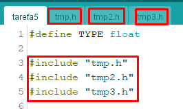
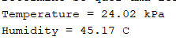
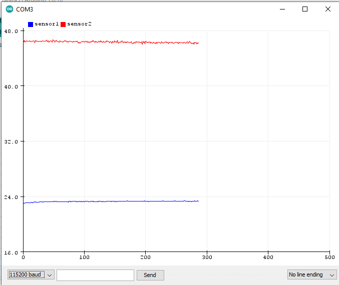
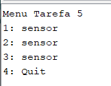
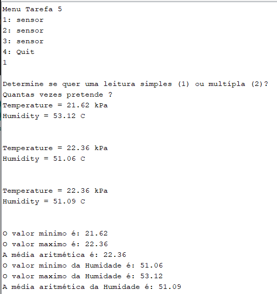

# Relatório da Tarefa 5

## Física Aplicada à Computação

### Licenciatura em Engenharia Informática - 1º Ano / 1º Semestre

#### Ano Lectivo 2021-22

#### Docente: Nuno S. A. Pereira

##### _Departamento de Matemática e Ciências Físicas_
---

### Autor(es):

#### Tiago Pacheco (N.º 20296)

---

## **Tarefa 5 - Visualização das leituras dos sensores**

<br>

## **Introdução**

Para a quinta tarefa de um conjunto de 6, foi pedido que fosse criado uma visualização das leituras de va'rios sensores forncedidos e introduzidos no arduino nano 33 ble. As leituras que se pretendia visualizarar seriam leituras do sensor HTS221 que monitorizava a Temperatura & Humidade Relativa , o sensor LPS22HB, onde este monitorizava a temperatura e pressão barométrica e por fim o sensor LSM9DSI, em que este monitorizava componentes do campo magnético, do giroscópio e do Acelerómetro.

<br>

### **Objectivo**

O objetivo para esta tarefa era que como, o Arduino Nano 33 BLE Sense possui vários sensores e estão disponíveis bibliotecas para podermos aceder às medições que efectuam fossem desensvolvidos alguns prótopidos , sendo considerado os seguintes passos:

1. Implementar um sketch que permiti-se ler as seguintes grandezas: Temperatura & Humidade Relativa (sensor  HTS221), Temperatura e Pressão Barométrica (sensor LPS22HB) e as 3 componentes do Campo Magnético, do Giroscópio e do Acelerómetro (sensor LSM9DS1). Coloque o código referente a cada sensor num módulo separado (por exemplo sensor*.h) e use a directiva #include "sensor*.h" no módulo principal. Desta forma a gestão do código fica bastante simplificada.

2. Utilizar directivas ao pré-processador para definir se o sketch anterior funciona em modo Serial Monitor ou Serial Plotter. Produza gráficos (Serial Plotter) e listagens (Serial Monitor) das grandezas disponíveis para testar o sketch.

3. Implementar um menu para o utilizador seleccionar o sensor que pretende visualizar, através de uma opção entrada pelo Serial Monitor. Por exemplo, cada sensor pode ser selecionado por um número ou uma letra que o identifica na lista do menu..

4. Acrescentar uma variante ao menu anterior, que permita ao utilizador definir uma leitura única ou uma série de leituras (número fornecido pelo utilizador). Após a listagem da série de valores deve apresentar os valores máximo, mínimo e a média aritmética das leituras efectuadas.

### **Método experimental**

Como ponto de partida foi necessário usar o método de incluir vários ficheiros , em que no principal possa aceder aos outros e utilizar os seus dados. Para isso foi necessário usar uma expressão , sendo ela um ```"#include"```, que pelo o seu nome tem o objetivo de inclusão. Este include só funciona quando tempo ficheiros do tipo .h, pois se forem .ino não funcional efetivamente. Com isto já é conseguido chamar funcões dos sensores em causa no ficheiro princial. Convem referir que estes ficheiros .h , terão o codigo representativo de cada sensor , para que os resultados estejam todos corretos.

<br>

<center>


<p align = "center"><i><b>Fig.1 - Inclusão ficheiros do tipo .h</b></i></p>


</center>


<br>
Com todos os sensores incluidos em ficheiros .h, como era o pretendido, onde nesses mesmos ficheiros foi colocado todo o código referente aos sensores, de modo a que os mesmos possam ser chamados no ficheiro principal. O que foi feito nesses 3 ficheiros .h , que foi bastante importante foi preparar o código para que fosse facilmente visualizado os valores de forma de plot e monitor facilmente e de uma forma objetiva. Para tal foi utilizado os #define em 2 funções bastante parecidas, sendo que uma seria para dar plot em gráfico dos sensores que estavam a ser monitorizados , enquanto que em outra função o codigo estava preparado para mostrar em modo de monitor, isto é, modo texto. Todo o código realizado está anexado na entrega deste relatório. Em baixo, sao mostrados um exemplo respetivo dos valores em modo monitor e outro exemplo em modo plotter.
<br>

<center>

<p align = "center"><i><b>Fig.2 - Monitorização sensor HTS221 - Modo Texto</b></i></p>

<p align = "center"><i><b>Fig.3 - Monitorização sensor HTS221 - Modo Plotter</b></i></p>

</center>

Com o procedimento anterior realizado , foi pedido que fosse criado um menu , no qual teria as seguintes particularidades : 

1. Perguntar ao utlizar qual o sensor que pretendia executar;
2. Questionar quantas vezes queria que o sensor fosse executado;
3. Mostrar valores, assim como o max , minimo e sua média aritmética.

Inicialmente foi criada a estrutura para o menu, tendo sido bastante importante usar o seguinte código: Serial.Available() < 1, pois este permite a que o utlizaddor possa escolhar uma opção, sendo essa opção gravada numa varíavel. De seguida foi contruida todas as questões assim como criadas algumas condições de modo a conseguir a haver uma maior possibilidade de conjuntos de respostas por parte do utilizador, como poderá ser visto nas imagens em baixo , assim como no código disponibilizado.
<br>
Com a parte estrutural e a boa possibilidade de várias respostas por parte do utilizador, foi então criado e definido os valores máximos e minimos dos sensores assim como a sua média como era o pretendido. Todo esse processo foi realizado através de várias condições simples e objetivas. O código realizado será anexado a este relatório.

<br>


<center>

<p align = "center"><i><b>Fig.4 - Menu - Introdução</b></i></p>

</center>
<br>

<br>

### **Resultados**


<center> <b><h3>Resultados Finais Tarefa 3</h3></b> </center>
<br>

<center>


<p align = "center"><i><b>Fig.5 - Menu em funcionamento</b></i></p>

</center>

<br><br>

### **Tratamento de dados**

Todos os dados foram tratados através de #defines, assim como de #includes , como referido anteriormente nos quais deram a possibilidade de ser possivel incluir outros ficheiros e conseguir obter informações de vários ficheiros.

``` c++ 

#define TYPE float

#include "tmp.h"
#include "tmp2.h"
#include "tmp3.h"

void setup() {
  Serial.begin(9600);
  while (!Serial);
}


```

### **Discussão**

A realização desta tarefa correu bem em geral, sendo que unciamente não consegui realizar a média aritmética do ultimo sensor, devido a alguns erros que obtive na sua realizaçao e portanto, não quis apresentar o código com esses mesmos erros. Para finalizar acho que a tarefa está bem realizada dentro do que era pedido.

<br>